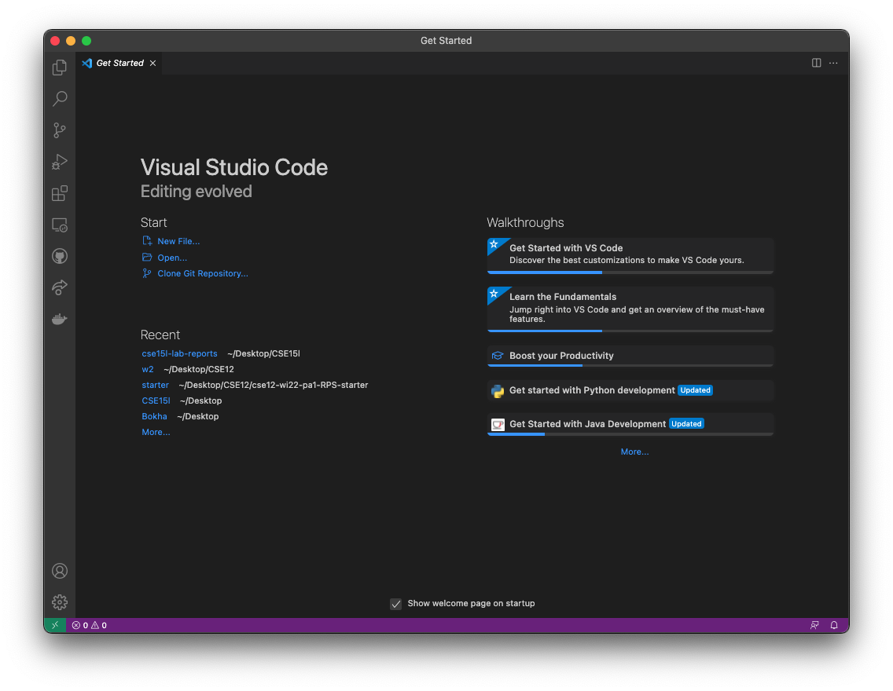
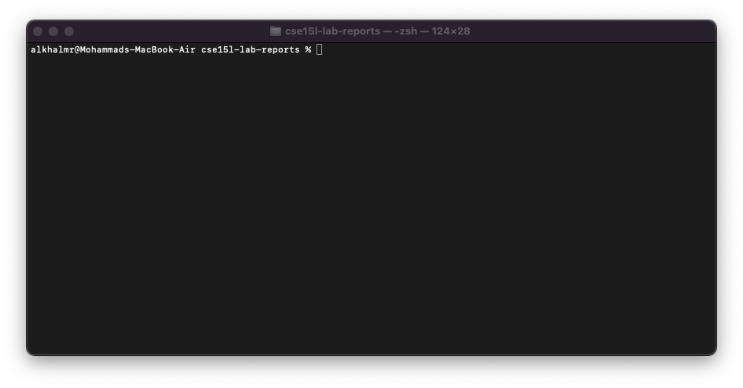
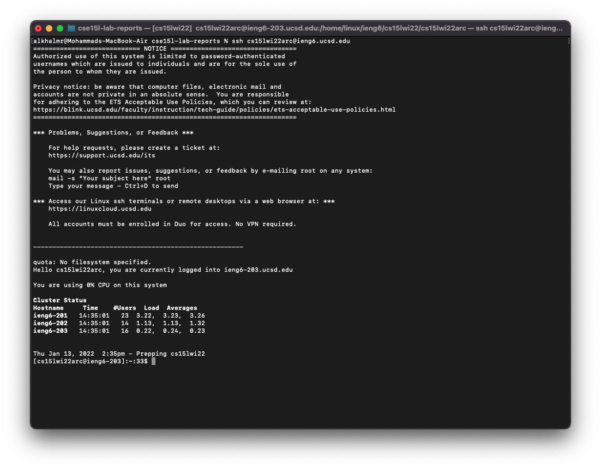
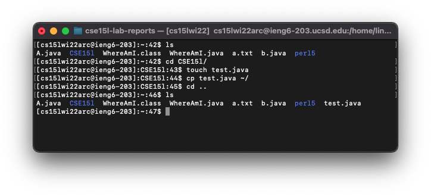
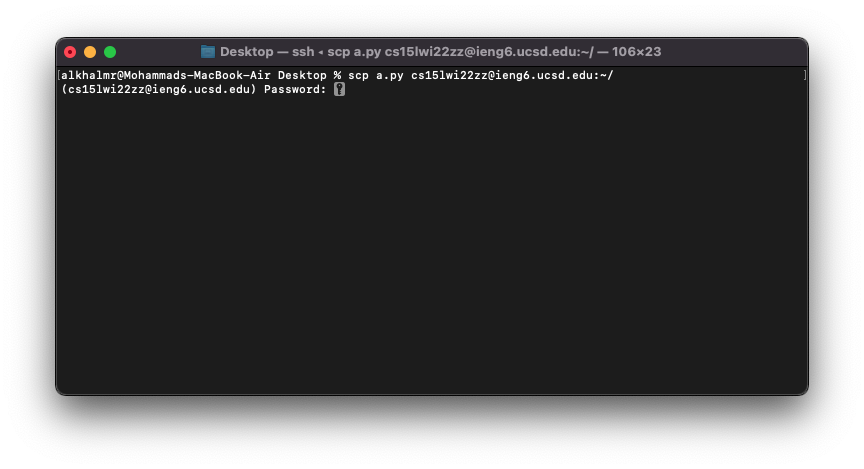
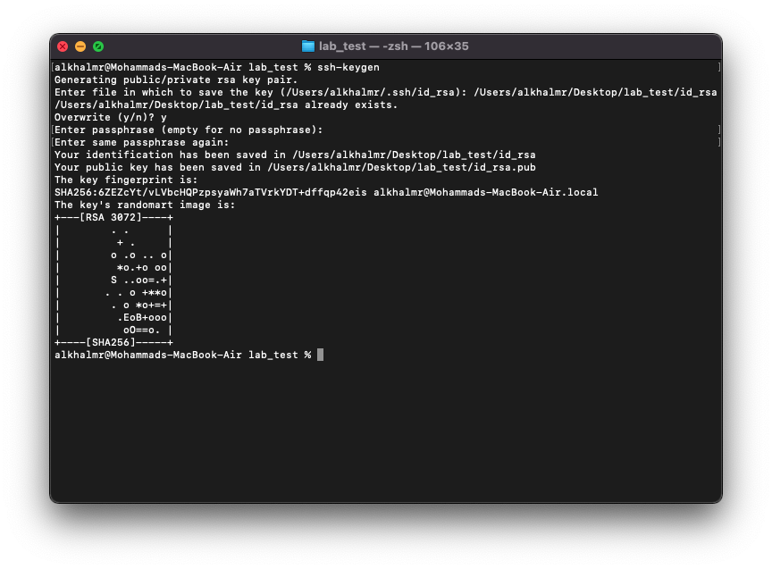
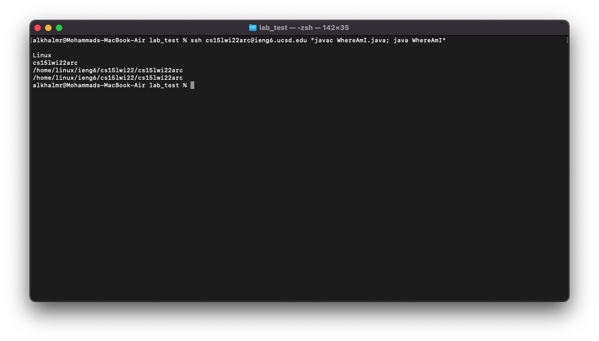

### Lab Report 1
# Remote Access

### Table of content:

  - [Installing VScode](#installing-vscode)
  - [Remotely Connecting](#remotely-connecting)
  - [Trying Some Commands](#trying-some-commands)
  - [Moving Files with `scp`](#moving-files-with-scp)
  - [Setting an SSH Key](#setting-an-ssh-key)
  - [Optimizing Remote Running](#optimizing-remote-running)

---

## Installing VScode:

To install VScode, start by visiting [https://code.visualstudio.com/download](https://code.visualstudio.com/download), then download the appropriate version. When you open the app, you should see something similar to this.



## Remotely Connecting:

Start by opening the terminal, either in VScode or your own command line. 
 
Then, type `$ ssh A` and replace **A** with your address, e.g., cs15lwi22zz@ieng6.ucsd.edu.

If this was your frist time to connect, you might see this massage: 

```
The authenticity of host 'ieng6.ucsd.edu (128.54.70.227)' can't be established.
RSA key fingerprint is SHA256:ksruYwhnYH+sySHnHAtLUHngrPEyZTDl/1x99wUQcec.
Are you sure you want to continue connecting (yes/no/[fingerprint])?
```

Enter yes, then it will asks you about the password.

```
Password: 
```

Enter your password, and you should see something like this:

 

## Trying Some Commands:

Here is a list of some helpful command to use:

1. `cd A` helps you change your directory to **A**.
2. `ls` shows all the file in this directory.
3. `touch A` if the file **A** exists it updates the update/modified date of the file and if the file doesn't exist it will create it for you \!  
4. `cp A B` copies files from A to B.
5. CTRL+D or `exit` to exit the server you're connected to.



## Moving Files with `scp`:

We will be using `scp` command to copy files from the client, i.e., your desktop, to the server.

Here is an example of how to use it:



## Setting an SSH Key:

This step will help you to avoid typing down your passowrd when running ```ssh `or` scp```.
Start by running `ssh-keygen` on your device, which will creates two files *public key*(`id_rsa.pub`) and *privte key*(`id_rsa`) stored in `.ssh`. 



Lastly, make `.ssh` file in your server (using `mkdir` command) and copy the public key to it.

## Optimizing Remote Running:

To make running commands on the server a bit easier and faster you can do like this:

```
$ssh cs15lwi22zz@ieng6.ucsd.edu "cd"
```

Also you can do multiple commands at the same by using `;`


