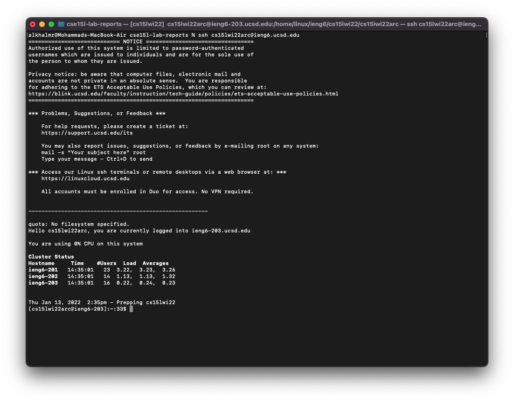

# Lab Report 1:  Remote Access using VScode

## Installing VScode:

To install VScode, start by visiting [https://code.visualstudio.com/download](https://code.visualstudio.com/download), then download the appropriate version. When you open the app, you should see something similar to this.

---
## Remotely Connecting
Start by opening the terminal, either in VScode or your own command line. 
 
Then, type `$ ssh address` and replace 'address', e.g., cs15lwi22zz@ieng6.ucsd.edu.

If this was your frist time to connect, you might see this massage 
```
The authenticity of host 'ieng6.ucsd.edu (128.54.70.227)' can't be established.
RSA key fingerprint is SHA256:ksruYwhnYH+sySHnHAtLUHngrPEyZTDl/1x99wUQcec.
Are you sure you want to continue connecting (yes/no/[fingerprint])?
```
Enter yes, then it will asks you about the password.
```
Password: 
```
Enter your password, and you should see something like this:
 

---
## Trying Some Commands
---
## Moving Files with `scp`
---
## Setting an SSH Key
---
## Optimizing Remote Running