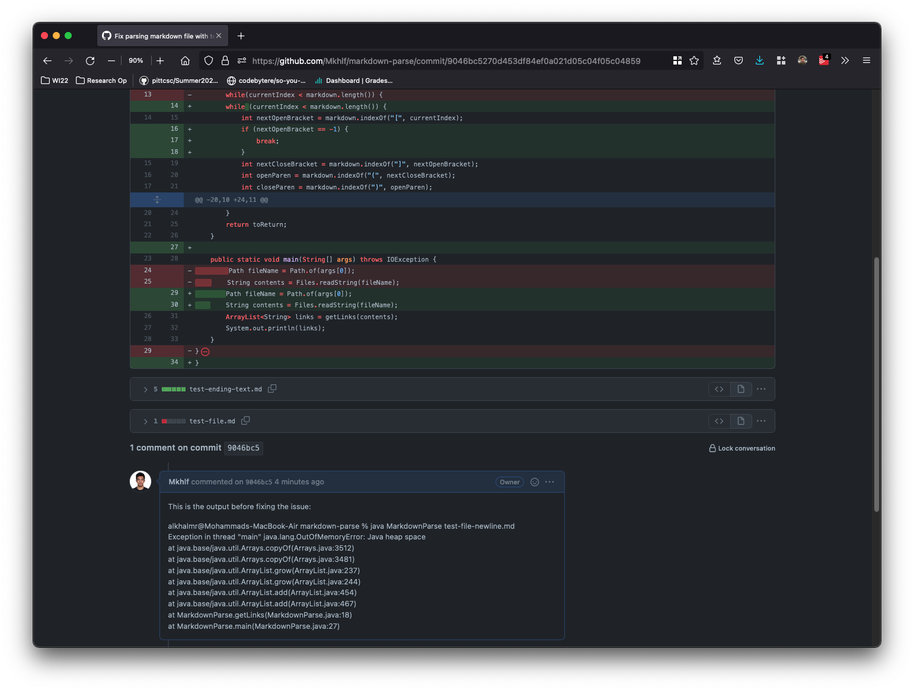
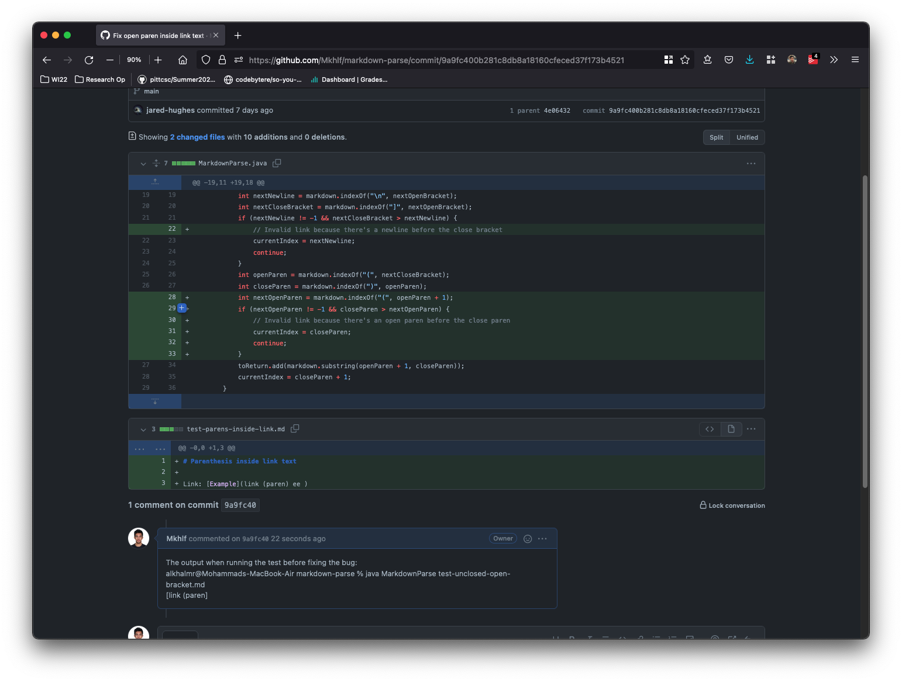
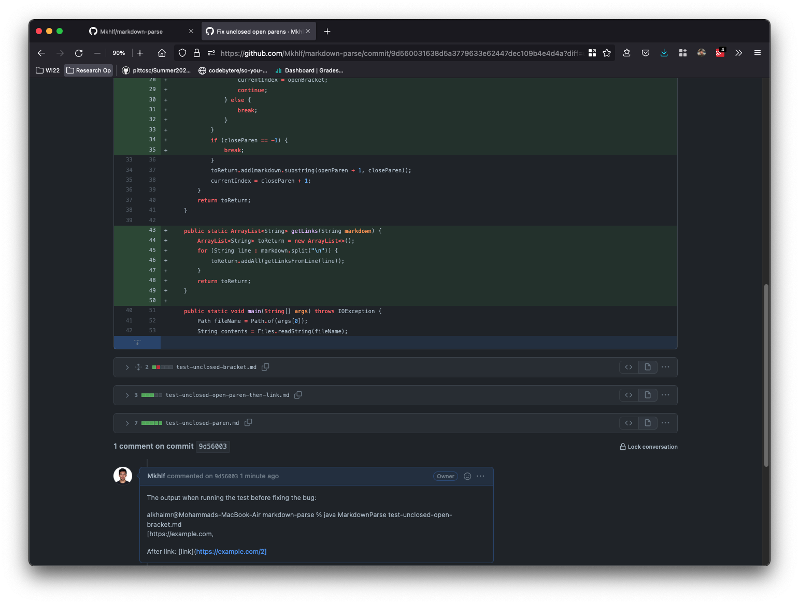

### Lab Report 2
# When Tests Accumulate

### Table of content:

  - [Overview](#overview)
  - [Case \#1:](#case-1)
  - [Case \#2:](#case-2)
  - [Case \#3:](#case-3)

---
## Overview
### This lab report will cover some of testes me and my group used to test the code provded [`MarkdownPrase`](https://github.com/ucsd-cse15l-w22/markdown-parse)

Using this as a starter Code:
```
// File reading code from https://howtodoinjava.com/java/io/java-read-file-to-string-examples/
import java.io.IOException;
import java.nio.file.Files;
import java.nio.file.Path;
import java.util.ArrayList;

public class MarkdownParse {
    public static ArrayList<String> getLinks(String markdown) {
        ArrayList<String> toReturn = new ArrayList<>();
        // find the next [, then find the ], then find the (, then take up to
        // the next )
        int currentIndex = 0;
        while (currentIndex < markdown.length()) {
            int nextOpenBracket = markdown.indexOf("[", currentIndex);
            int nextCloseBracket = markdown.indexOf("]", nextOpenBracket);
            int openParen = markdown.indexOf("(", nextCloseBracket);
            int closeParen = markdown.indexOf(")", openParen);
            toReturn.add(markdown.substring(openParen + 1, closeParen));
            currentIndex = closeParen + 1;
        }
        return toReturn;
    }

    public static void main(String[] args) throws IOException {
        Path fileName = Path.of(args[0]);
        String contents = Files.readString(fileName);
        ArrayList<String> links = getLinks(contents);
        System.out.println(links);
    }
}

```


## Case \#1:
###  Change diff from [Github](https://github.com/Mkhlf/markdown-parse/commit/9046bc5270d453df84ef0a021d05c04f05c04859):
[](https://github.com/Mkhlf/markdown-parse/commit/9046bc5270d453df84ef0a021d05c04f05c04859)


When running this [test-file](https://github.com/Mkhlf/markdown-parse/blob/main/test-ending-text.md) I get the following output: 

```
alkhalmr@Mohammads-MacBook-Air markdown-parse % java MarkdownParse test-file-ending-text.md
Exception in thread "main" java.lang.OutOfMemoryError: Java heap space
        at java.base/java.util.Arrays.copyOf(Arrays.java:3512)
        at java.base/java.util.Arrays.copyOf(Arrays.java:3481)
        at java.base/java.util.ArrayList.grow(ArrayList.java:237)
        at java.base/java.util.ArrayList.grow(ArrayList.java:244)
        at java.base/java.util.ArrayList.add(ArrayList.java:454)
        at java.base/java.util.ArrayList.add(ArrayList.java:467)
        at MarkdownParse.getLinks(MarkdownParse.java:18)
        at MarkdownParse.main(MarkdownParse.java:27)
```
However, the expected output is:
```
alkhalmr@Mohammads-MacBook-Air markdown-parse % java MarkdownParse test-file-newline.md
[https://something.com, some-page.html]
```

The symptom here is trying to access some part of the momery, which does not exists. This occurs when there is no "\[" left in the file and there is some texts after that, a.k.a `nextOpenBracket = -1`. To solve this I added an `if` statement to check when `nextOpenBracket` and break the loop at that point. 

## Case \#2:

###  Change diff from [Github](https://github.com/Mkhlf/markdown-parse/commit/9a9fc400b281c8db8a18160cfeced37f173b4521):
[](https://github.com/Mkhlf/markdown-parse/commit/9a9fc400b281c8db8a18160cfeced37f173b4521)


When running this [test-file](https://github.com/Mkhlf/markdown-parse/blob/main/test-parens-inside-link.md) I get the following output: 

```
alkhalmr@Mohammads-MacBook-Air markdown-parse % java MarkdownParse  test-parens-inside-link.md
[link (paren]
```
However, the expected output is: 
```
alkhalmr@Mohammads-MacBook-Air markdown-parse % java MarkdownParse test-parens-inside-link.md
[]
```
The symptom here is not printing an Invalid link. This occurs when there is "\(\)" within the link "\(\)", which should make this link invalid. To solve this I check if the `nextOpenParen` index is between the current `openParen` and the `closeparen`. 

## Case \#3:


###  Change diff from [Github](https://github.com/Mkhlf/markdown-parse/commit/9d560031638d5a3779633e62447dec109b4e4d4a?diff=unified):
[](https://github.com/Mkhlf/markdown-parse/commit/9d560031638d5a3779633e62447dec109b4e4d4a?diff=unified)


When running this [test-file](https://github.com/Mkhlf/markdown-parse/blob/main/test-unclosed-paren.md) I get the following output: 

```
alkhalmr@Mohammads-MacBook-Air markdown-parse % java MarkdownParse test-unclosed-open-bracket.md
[https://example.com, 

After link: [link](https://example.com/2]
```
However, the expected output is: 
```
alkhalmr@Mohammads-MacBook-Air markdown-parse % java MarkdownParse test-unclosed-open-bracket.md
[https://example.com, https://example.com/2]
```

The symptom here is printing multiple line invalid link. This occurs when there is an open link's "\(" that was not closed. To solve this I added a function to look at the file line by line only, insead of looking at it fully, while keeping the same logic.