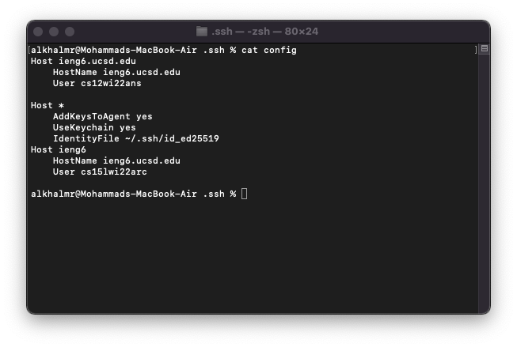
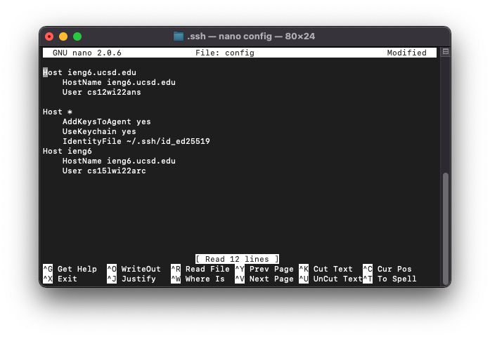
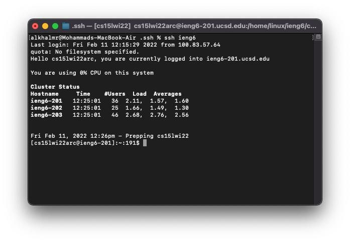
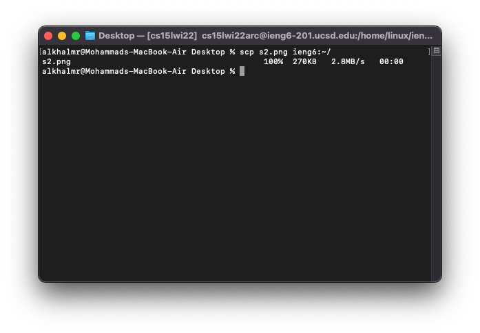

 <style>
       
     .center {
        text-align: left;
        margin: auto;
        width: 50%;
        padding: 20px;
        
}
    </style>


<center>

### Lab Report 3
# Streamlining ssh Configuration

</center>


<div class="center">
    <li><a href="#streamlining-ssh-configuration">Streamlining ssh Configuration</a></li>
    <li><a href="#sshconfig"><code>.ssh/config</code></a></li>
    <li><a href="#logging-in">Logging in</a></li>
    <li><a href="#copying-a-file">Copying a file</a></li>
    
</div>


---
<center>

## ```.ssh/config```

Here is the content of my ```.ssh/config```:



I edited it using nano editor: 




## Logging in




## Copying a file





---

Mohammad Alkhalifah Lab's for [CSE15 lab](https://ucsd-cse15l-w22.github.io/)

[Home page](index.md)
 </center>
